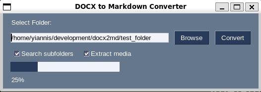

# DOCX to Markdown Converter

<p align="center">
  
</p>

This is a simple Python application that converts DOCX files to Markdown (.md) format. It provides a graphical user interface (GUI) using the PySimpleGUI library, allowing users to select a folder containing DOCX files, specify conversion options, and initiate the conversion process. The converter supports the extraction of media files embedded within the DOCX documents.

## Features

<p align="center">
  
</p>

- **Folder Selection**: Users can select a folder containing DOCX files to be converted.
- **Recursive Search**: Optionally, users can choose to include subfolders for DOCX file search.
- **Media Extraction**: Users can opt to extract media files (images, videos, etc.) embedded within the DOCX documents.
- **Progress Bar**: Displays the progress of the conversion process with a graphical progress bar.
- **User-Friendly Interface**: Intuitive GUI with options for easy navigation and conversion.

## Prerequisites

Make sure you have the following installed before running the application:

- Python 3.x
- Required Python packages: `os`, `argparse`, `PySimpleGUI`, `Pillow`, `pypandoc`

## How to Use

1. **Clone the Repository:**

   ```bash
   git clone git@github.com:YianniR/docx2md.git
   cd docx2md
   ```

2. **Install Dependencies:**

   ```bash
   pip install Pillow pypandoc PySimpleGUI
   ```

3. **Run the Application:**

   ```bash
   python convert.py
   ```

4. **Using the Application:**

   - Click on the "Browse" button to select the folder containing DOCX files.
   - Check the "Search subfolders" option if you want to include subfolders in the search.
   - Check the "Extract media" option if you want to extract media files from the DOCX documents.
   - Click the "Convert" button to start the conversion process.
   - The progress bar will show the progress of the conversion.
   - Once the conversion is complete, the application will display "Done!".

## Notes

- The converted Markdown files will be saved in the same location as the original DOCX files.
- Media files (if extracted) will be saved in a "media" folder within the same directory as the original DOCX files.
